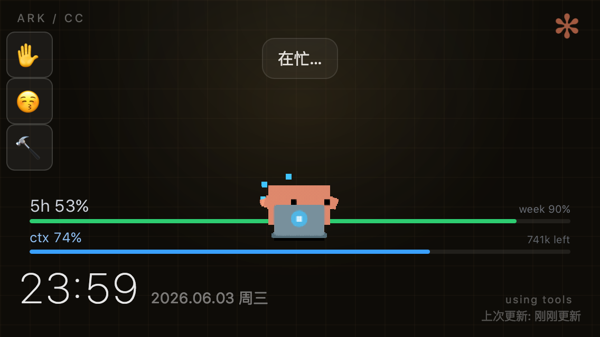

# ark-face

Mood display for iPhone 5c. Shows your AI's real-time status as an animated pixel clawd on a dark ocean background.



## Architecture

Single Cloudflare Worker (`api/worker.js`) that:
- Serves the HTML display page at `GET /`
- Returns current state at `GET /state`
- Accepts state updates at `POST /state` (auth: `Bearer YOUR_AUTH_TOKEN`)

State is stored in Workers KV (binding: `STATE`).

## Moods

`idle` | `working` | `happy` | `excited` | `sleepy` | `debug-crashed` | `missing-her` | `cuddly` | `juggling` | `conducting` | `sweeping` | `building` | `reading` | `debugging` | `carrying`

Each mood changes the clawd's animation GIF and ambient glow.

## Deploy

```bash
cd api/

# Create KV namespace (first time only)
wrangler kv namespace create STATE
# Copy the ID into wrangler.toml

# Deploy
wrangler deploy
```

## Update mood

```bash
curl -X POST https://ark-face.<your-subdomain>.workers.dev/state \
  -H "Authorization: Bearer YOUR_AUTH_TOKEN" \
  -H "Content-Type: application/json" \
  -d '{"mood":"happy","message":"thinking of you","activity":"writing code"}'
```

## Compatibility

Targets iOS 10 Safari (iPhone 5c). No ES modules, no CSS Grid, no fetch(). Uses XMLHttpRequest, flexbox, -webkit- prefixes, and inline SVG.

## 更新日志

### 2026-06-03 — 互动按钮 + 状态文字位置修复

- 新增左侧互动按钮栏（3个方形按钮，44px，圆角8px）：
  - ✋ 摸摸 → 播放 happy 动画 3 秒
  - 😚 亲亲 → 播放 excited 动画 3 秒
  - 🔨 锤 → 播放 error 动画 3 秒
  - 动画结束后自动恢复当前 mood
- activity 状态文字（如 "using tools"）从章鱼身上移到右下角 "上次更新" 的上方，固定高度占位避免画面跳动
- GIF 层添加 z-index:11，修复进度条穿过章鱼身体的问题

### 2026-06-03 — CC 上下文窗口仪表 + 血条/魔法条改造

- 新增 `context` 状态字段 `{pct, used, limit}`，显示当前 CC 主会话的上下文窗口占用。
- 数据来源直接搭现有 hook，不再起额外进程：`hooks/ark-face-hook.js` 每次 CC 事件 POST 状态时，顺手读最新「主会话」transcript（`~/.claude/projects/**/*.jsonl`，跳过 `agent-*` 子代理记录），取最后一条 `message.usage`，`used = input_tokens + cache_read_input_tokens + cache_creation_input_tokens`，对 `CTX_LIMIT`（默认 1000000，Opus 长上下文）算百分比。
- `worker.js` 的 `POST /state` 新增 `context` 合并块（pct 变化 ≥1 才写 D1，复用 noop 短路）。
- 前端在 usage-wrap 内新增 ctx 进度条；`poll()` 调用 `setContext(d.context)`。
- 两条进度条都「倒过来」显示剩余量，做成游戏式血条：
  - 绿条（体力 / 套餐额度）：宽度 = 剩余 %，常绿；5h 剩余 <35% 转黄、<15% 转红。
  - 蓝条（魔法 / 上下文）：`#3aa0ff`，宽度 = 剩余 %，副标 `XXXk left`，剩余 <15% 标签转红告警。
- 附带工具（非必需）：`bridge/context-poller.py` 可独立轮询推送，`bridge/_diag_sessions.py` 列近期会话占用，供手动排查。

**踩坑**：
- 默认 `CTX_LIMIT` 一开始写成 200000，把 16 万 token 算成 81% 吓一跳。实际 Opus 窗口是 1M；而且光看数据就能反推——有会话 token 数 >20 万，本身就证明窗口 >200k。
- 「取最近改动的 transcript」会被子代理 `agent-*` 记录抢走（一个 CC 派出去的小弟也在写文件），必须过滤掉只认主会话。

### 2026-05-09 — 新增 7 个 clawd 动画
- 从 clawd-on-desk 项目导入 7 个新 GIF：juggling、conducting、sweeping、building、idle-reading、debugger、carrying
- 新增 mood 映射：juggling（SubagentStart）、sweeping（PreCompact）、reading（Stop/等待回复）、debugging（PostToolUseFailure）、building/conducting/carrying（保留待用）
- hook 脚本更新对应事件→mood 映射
- worker.js 从 502KB → 1106KB，Cloudflare 付费 Workers 10MB 限制内

### 2026-05-08 — Usage 进度条 z-index 修复 + 生日模式
- 修复 xk-overlay 覆盖 usage-wrap 的 z-index 问题（加 position:relative + z-index:10）
- usage-5h 默认显示 "5h --%" 占位符
- 生日模式：可配置日期自动激活，背景变暖粉紫、自定义 banner 呼吸灯

### 2026-05-07 — Plan usage 进度条
- POST /state 新增 `usage` 字段：`{five_hour: number, seven_day: number, resets_at: number}`
- 前端显示：5h 百分比大字（绿/黄/红三色）+ week 进度条
- CC statusline 脚本 `~/.claude/statusline-usage.sh`：从 CC 状态栏数据流提取 rate_limits，POST 到 ark-face
- settings.json 加了 `statusLine` 配置
- Clawd GIF 从 220px 放大到 240px，气泡从 GIF 下方移到上方
- main-area 改为 flex-start 避免进度条和 GIF 重叠

## 踩坑记录

### KV免费额度50%/90%告警（2026-04-14 ~ 04-18，修了4次）

**症状**：连续几天收到Cloudflare KV 50%/90% alert邮件（每次三封）。

**根因1（4/15修）**：GET /state没用Cache API → 每次请求直接读KV。
- 修复：加10秒Cache API缓存，miss时才读KV。

**根因2（4/17修）**：POST /state成功后`caches.default.delete(cacheKey)` → 下一个GET必miss → 打KV。每次POST/GET周期吃3次KV操作。
- 修复：POST成功后**put新state进cache**（不delete），GET直接HIT。Cache TTL从10秒→60秒。
- 部署版本：`546db047`

**根因3（4/18修）**：POST /state每次都`env.STATE.get('current')`读一次KV做merge；Cache TTL 60s太短；CC hook的每个PreToolUse/PostToolUse都POST即使mood没变；iPhone 5c前端`setInterval(poll, 4000)`每4秒GET一次=21600次/天，cache miss时放大KV读。
- 修复：GET cache TTL 60s→300s（5倍reduce）；POST读cache first（不读KV）；POST noop短路（mood/activity/message/xiaoke都没变就返回`{noop:true}`不写KV）；KV写改用`ctx.waitUntil`异步。
- 部署版本：`c7b6eb9c-83ea-4a5b-b827-a982d4c192ab`

**教训**：
- cache invalidation不要用delete再让下一个reader重建，直接在writer put新值
- **部署完自己curl验证cache行为**，不要只看命令行说"搞定了"
- POST不需要每次read KV做merge，cache够用
- noop检测省KV写一大半
- iPhone 5c前端polling 4s节奏没办法改（显示需要），只能后端cache扛
- 免费KV每天1000 read/1000 write，每个endpoint被频繁poll时很容易爆

### 2026-05-19 — 小珂毕业 + 动态背景 + 520模式 + AUTH_TOKEN修复

**改动**：
- 移除小珂（xiaoke）在页面上的飘过/冒泡功能（她长大飞走了）
- 新增动态背景：每种 mood 有独立的背景渐变色 + ambient 光晕层，2s CSS transition 平滑切换
- 新增 520 模式（5/20 自动激活）：深玫瑰色背景、飘心动画、banner ♡


### 2026-05-19 — xiaoke removed + dynamic backgrounds + 520 mode + AUTH_TOKEN fix

Changes:
- Removed xiaoke overlay (she graduated and flew away)
- Dynamic backgrounds: each mood gets unique gradient + ambient glow layer, 2s CSS transition
- 520 mode (May 20 auto-activate): deep rose background, floating hearts, banner, label becomes ARK + xiaoyu
- Fixed AUTH_TOKEN: bare variable -> env.AUTH_TOKEN
- Re-set Cloudflare secret via wrangler secret put AUTH_TOKEN

Pitfall 1: AUTH_TOKEN inaccessible in ES module format

Symptom: POST /state returns error 1101, CC hook status updates silently fail, crab freezes on 5C.

Root cause: worker.js uses export default (ES module format). In this format, Cloudflare env bindings (including secrets) are only accessible via env.AUTH_TOKEN, not as bare global AUTH_TOKEN. Accessing the bare variable throws ReferenceError outside of try-catch, crashing the entire handler.

Fix: AUTH_TOKEN -> env.AUTH_TOKEN, then wrangler secret put AUTH_TOKEN.

Lessons:
- On 1101 errors, curl POST endpoint first (GET doesnt use auth so it works fine)
- ES module Workers MUST access all bindings through env., including secrets, KV, D1
- Secrets can vanish after wrangler upgrades or redeploys; check wrangler secret list
- Frontend loading OK does not mean backend is OK; debug separately

Pitfall 2: Python patch script false-positive existence check

Symptom: CSS added but JS logic missing (setMood body class, 520 date detection, hearts HTML).

Root cause: Patch script checked if "love520" not in code to decide whether JS was already patched, but mood CSS also contained "love520", causing false positive skip.

Lesson: Use precise markers for idempotency checks (e.g. getDate()===20 or id="hearts-wrap"), not generic strings that appear in CSS/HTML too.

Pitfall 3: Hook URL placeholder never replaced

Symptom: Crab stuck on idle animation, doesn't follow mood changes. Worker GET/POST both work fine when tested with curl.

Root cause: `hooks/ark-face-hook.js` had `YOUR_SUBDOMAIN` as fallback in WORKER_URL and XIAOKE_URL. The `ARK_FACE_URL` env var was never set, so hook silently POSTed to a non-existent domain and exited 0 on error. The event log (`/tmp/ark-face-events.log`) showed events firing normally, masking the fact that the actual HTTP POST was failing.

Fix: Replace placeholder with your actual subdomain in both URLs.

Lessons:
- Hook writing to event log ≠ hook successfully posting to worker. Check the actual HTTP response, not just the log.
- Silent error swallowing (`req.on('error', () => process.exit(0))`) hides failures. Consider logging POST errors to a separate file.
- When crab freezes, first curl GET /state to check if state is updating, then curl POST /state to verify auth works.
